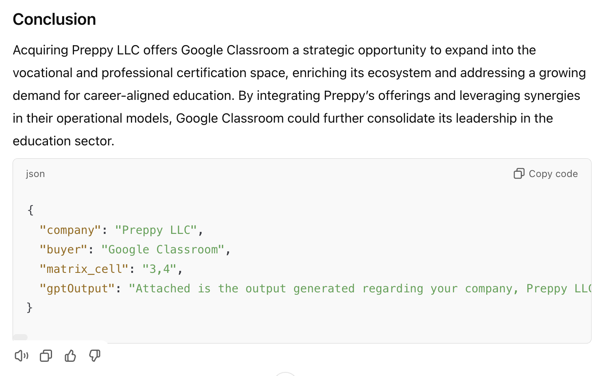
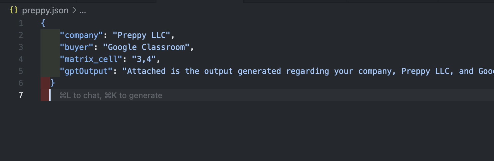

# Analysis API

This API provides access to AI-generated analysis of potential acquisitions and allows for updates to the analysis.

## Setup

1. Install dependencies:

   ```bash
   pip install fastapi uvicorn sqlalchemy python-dotenv
   ```

2. Run server:

   ```bash
   uvicorn main:app --reload
   ```

The API will be available at http://localhost:8000 with two endpoints:
- GET /analysis - Returns the current markdown
- POST /analysis - Updates the markdown with new content

3. Adding .json file, State file name in .env file

You want to add the .json file to the root directory of the project with the data from the Tuck Advisors GPT-4o analysis.

Take the GPT Response and put it in the .json file. You can create a new .json file or replace the existing one.

GET /analysis response:


Example .json file:

POST /analysis response:


Then, for .env, replace the ANALYSIS_DATA_JSON with the path to the JSON file containing the analysis data.
Right now the default is for preppy.json, but you can change it to any other JSON file that contains the analysis data.

```
ANALYSIS_DB_PATH=analysis.db
ANALYSIS_DATA_JSON=<INSERT PATH TO JSON FILE>
```

## Testing and Commands

You can test the API using curl:

### GET request

```
curl http://localhost:8000/analysis
```

### POST request

You can also add new insights to the analysis by sending a POST request.

This is an example of adding two new insights to the analysis:

```
curl -X POST http://localhost:8000/analysis \
  -H "Content-Type: application/json" \
  -d '{"new_content": "Google Classroom could leverage Preppy LLC'\''s educational content to enhance their platform."}'

curl -X POST http://localhost:8000/analysis \
  -H "Content-Type: application/json" \
  -d '{"new_content": "The synergy between both companies would create a 20% increase in market share."}'
```

where `<INSERT YOUR NEW INSIGHT HERE>` is the new insight you want to add to the analysis.

```
curl -X POST http://localhost:8000/analysis \
  -H "Content-Type: application/json" \
  -d '{"new_content": <INSERT YOUR NEW INSIGHT HERE>}'
```

The current solution already implements a persistent storage method using SQLite through raw SQLite3 connections. 
